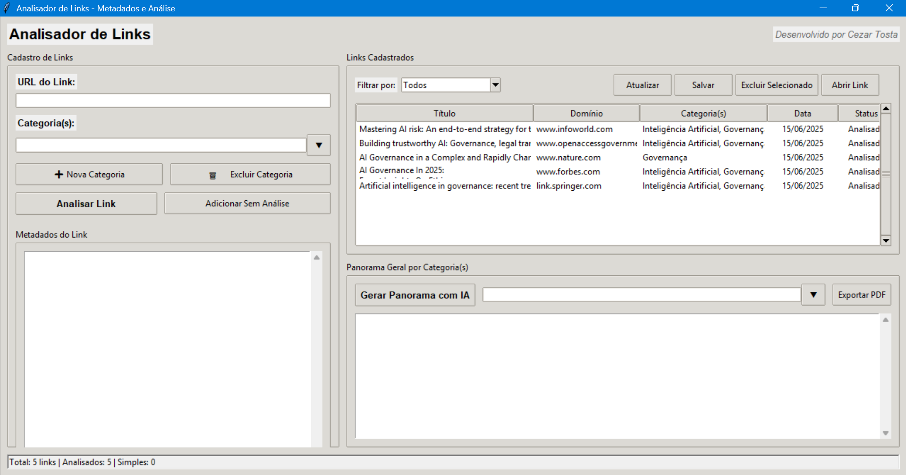
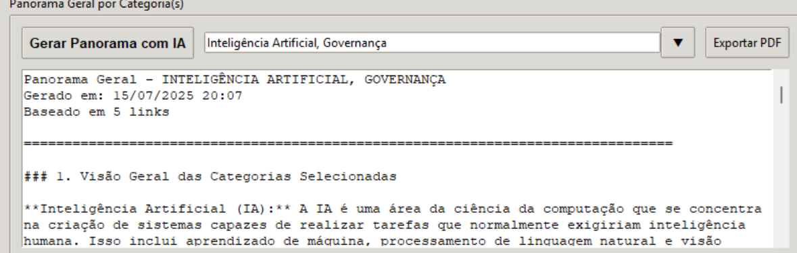
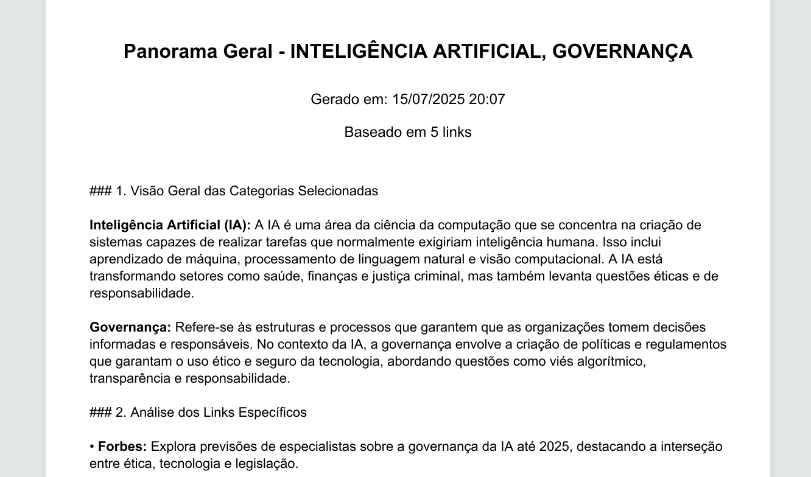
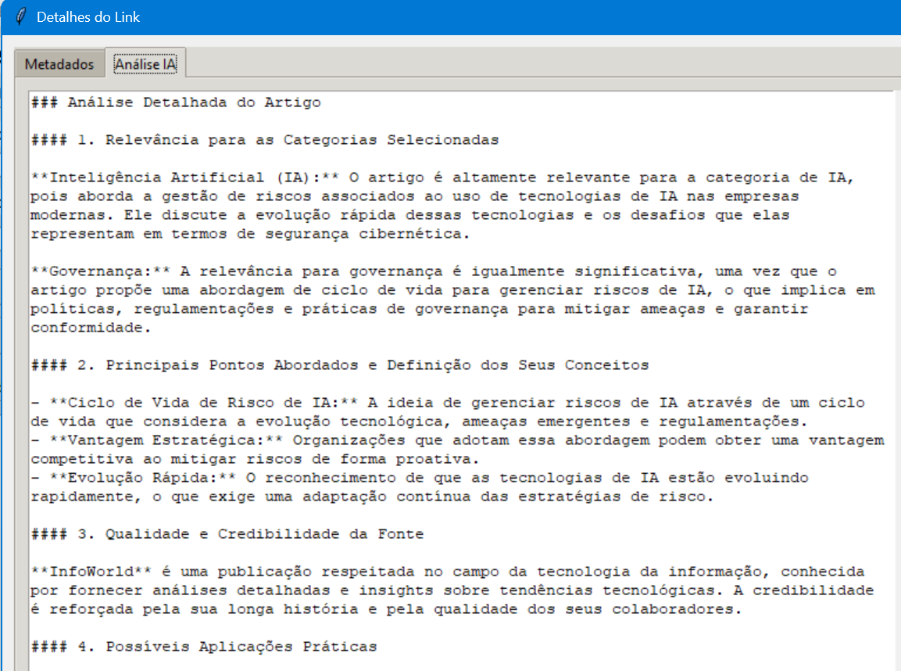

# 🚨**INSTRUÇÕES DE USO**

- Instale as dependências "pip install requests beautifulsoup4 reportlab"
- Altere ou insira a chave API na linha 13 do arquivo analisador.py
- Execute: "python analisador.py"
- Para gerar o .exe: "pyinstaller --onefile analisador.py"

# 📌 **DESCRIÇÃO**

O Analisador de Links é uma aplicação voltada para a organização e análise inteligente de URLs. A partir da inserção de links, o sistema realiza a extração automática de metadados e uma análise baseada em inteligência artificial (via API). Os links podem ser categorizados, armazenados e, posteriormente, utilizados para gerar panoramas analíticos com base nas categorias definidas.

# 🛠️ **FUNCIONALIDADES**
- 🔗 Cadastro de Links: insira a URL de um artigo, notícia ou conteúdo relevante.
- 🗂️ Gestão de Categorias: crie, edite ou exclua categorias personalizadas.
- 🧠 Análise Inteligente: analisa o conteúdo do link e extrai insights e metadados automaticamente.
- 🗃️ Listagem com Filtros: visualize todos os links cadastrados, filtrando por categoria.
- 🧾 Panorama por Categoria: gere um resumo analítico por categoria, com auxílio da IA.
- 📄 Exportação em PDF: exporte o panorama em formato PDF para relatórios e apresentações.

# 📷 **INTERFACE**
A interface é intuitiva, com seções para:
- Cadastro e categorização de links.
- Visualização de links já cadastrados com título, domínio, categoria, data e status.
- Metadados detalhados do link selecionado.
- Geração de panoramas analíticos com IA.
- Exportação do conteúdo em PDF.

# 💡**EXEMPLOS DE USO**
- Insira um link de um artigo sobre Governança ou Inteligência Artificial.
- Escolha (ou crie) uma categoria para esse link.
- Clique em Analisar Link para extrair metadados e aplicar a IA.
- Após vários links cadastrados, gere um Panorama com IA por categoria.
- Exporte o relatório em PDF para uso profissional ou acadêmico.

### 📊 Geração do Panorama (por Categoria)

### 🔍 Análise do Link (Individualmente)

